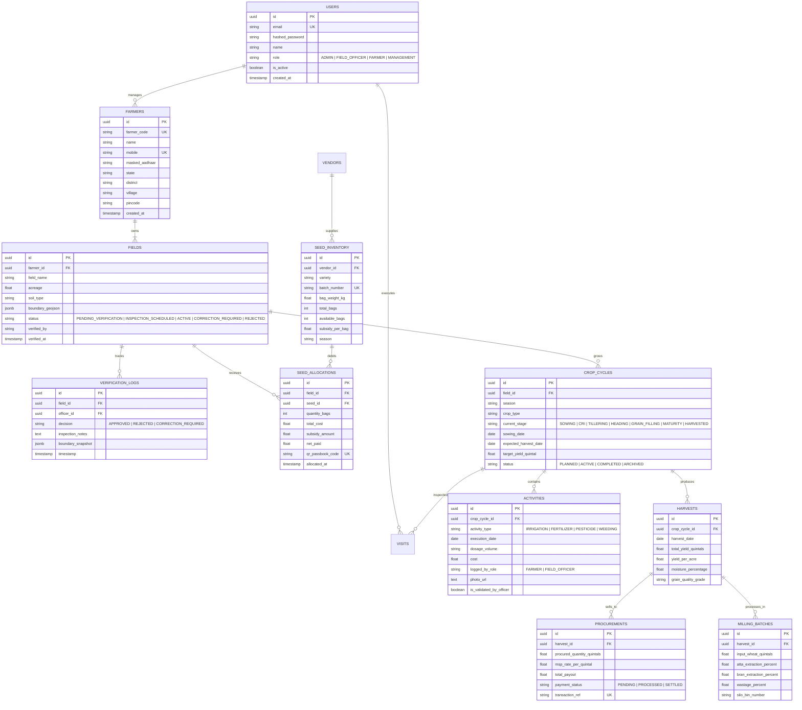

# Krishi AgriTech: Production-Ready End-to-End Architecture & Workflow

> **Platform:** Krishi AgriTech — Smart Farmer, Subsidized Seed Distribution & Crop Lifecycle Management  
> **Target Season / Scope:** Configurable Multi-Season (e.g., Rabi / Kharif / Zaid) & Multi-Crop (Wheat, Paddy, Pulses)  
> **Document Version:** 2.0.0 (Production Architecture Specification)  
> **Author:** Senior Software Architect & AgriTech Domain Specialist  

---

## Executive Summary & System Overview

**Krishi AgriTech** is an enterprise-grade digital agriculture platform designed to bridge the operational gap between agricultural administration, field agronomists, and grassroots farmers. The platform orchestrates the complete agricultural lifecycle:
1. **Secure Onboarding & GIS/GPS Land Base:** KYC verification with Aadhaar privacy masking, automated PIN code resolution, and spatial polygon mapping.
2. **Quota-Governed Subsidized Seed Distribution:** Batch-tracked inventory management with acreage-based allocation rules, digital QR passbook receipts, and anti-leakage controls.
3. **Dynamic Crop Lifecycle & Auditable Agronomy:** Configurable growth stages, dual-channel logging (Farmer self-logging and Field Officer validation), IoT/Weather telemetry, and pest/disease scouting.
4. **Harvest, Quality Assessment & Procurement:** Multi-tier yield tracking, moisture/quality grading, optional Mandi MSP procurement settlement, and downstream flour milling integration.
5. **Real-time Analytics & Immutable Audit Trail:** Role-based access control (RBAC), executive KPIs, and tamper-evident compliance logs.

---

## Section A: Existing Workflow Analysis & Gap Assessment

A thorough architectural review of the preliminary workflow revealed critical gaps that have been addressed in this production specification:

```
┌──────────────────────────────────────────────────────────────────────────────────────────┐
│                             CRITICAL GAPS IDENTIFIED & RESOLVED                          │
├───────────────────────────────┬──────────────────────────────────────────────────────────┤
│ Architectural Area            │ Gap in Basic Flowchart vs Production Solution            │
├───────────────────────────────┼──────────────────────────────────────────────────────────┤
│ 1. RBAC & Persona Scope       │ Lacked Management / Auditor persona. Solved with 4-tier  │
│                               │ RBAC (Admin, Field Officer, Farmer, Management).         │
├───────────────────────────────┼──────────────────────────────────────────────────────────┤
│ 2. Land Verification Loop     │ Linear flow assumed 100% approval. Added full decision   │
│                               │ states: Approved, Rejected, Correction Required, Re-eval.│
├───────────────────────────────┼──────────────────────────────────────────────────────────┤
│ 3. Aadhaar / KYC Privacy      │ Raw Aadhaar exposure risk. Implemented UIDAI compliant  │
│                               │ 8-digit masking (XXXX-XXXX-1234) and SHA-256 vaulting.   │
├───────────────────────────────┼──────────────────────────────────────────────────────────┤
│ 4. Seed Inventory Control     │ Lacked batch inward & quota locks. Implemented real-time │
│                               │ stock lock, negative-inventory guard, and dup check.    │
├───────────────────────────────┼──────────────────────────────────────────────────────────┤
│ 5. Crop Stage Governance      │ Stage transitions lacked validation. Added dual-logging   │
│                               │ with auditable Field Officer approval gates.             │
├───────────────────────────────┼──────────────────────────────────────────────────────────┤
│ 6. Optionality of Downstream  │ MSP Procurement & Milling were hardcoded as mandatory.    │
│                               │ De-coupled into configurable, independent micro-modules. │
├───────────────────────────────┼──────────────────────────────────────────────────────────┤
│ 7. Telemetry & Parallelism    │ Weather alerts were single-threaded. Designed as async   │
│                               │ real-time event-driven telemetry channels.               │
└───────────────────────────────┴──────────────────────────────────────────────────────────┘
```

---

## Section B: End-to-End Master Architecture & Workflow Diagram

```mermaid
flowchart TD
    %% Global Styling Definitions
    classDef adminNode fill:#0f172a,stroke:#38bdf8,stroke-width:2px,color:#f8fafc;
    classDef officerNode fill:#064e3b,stroke:#34d399,stroke-width:2px,color:#f8fafc;
    classDef farmerNode fill:#78350f,stroke:#fbbf24,stroke-width:2px,color:#f8fafc;
    classDef mgmtNode fill:#4c1d95,stroke:#c084fc,stroke-width:2px,color:#f8fafc;
    classDef systemNode fill:#134e4a,stroke:#2dd4bf,stroke-width:2px,color:#f8fafc;
    classDef decisionNode fill:#3b0764,stroke:#e879f9,stroke-width:2px,color:#fdf4ff;
    classDef alertNode fill:#881337,stroke:#fb7185,stroke-width:2px,color:#fff1f2;

    %% ==========================================
    %% PHASE 0: AUTHENTICATION & RBAC
    %% ==========================================
    subgraph P0 ["🔐 Phase 0: Unified Authentication & RBAC Engine"]
        AUTH_IN["Login Request (Identifier + Credentials)"]:::systemNode
        AUTH_VAL{"Valid Credentials & Role Active?"}:::decisionNode
        AUTH_FAIL["Return 401 Unauthorized / Lockout Policy"]:::alertNode
        
        RBAC_ADMIN["Admin Portal / Command Center"]:::adminNode
        RBAC_OFFICER["Field Officer Mobile Suite"]:::officerNode
        RBAC_FARMER["Farmer Digital Passbook App"]:::farmerNode
        RBAC_MGMT["Management & Audit Console"]:::mgmtNode
        
        AUTH_IN --> AUTH_VAL
        AUTH_VAL -- "Invalid" --> AUTH_FAIL
        AUTH_VAL -- "Role: ADMIN" --> RBAC_ADMIN
        AUTH_VAL -- "Role: FIELD_OFFICER" --> RBAC_OFFICER
        AUTH_VAL -- "Role: FARMER" --> RBAC_FARMER
        AUTH_VAL -- "Role: MANAGEMENT" --> RBAC_MGMT
    end

    %% ==========================================
    %% PHASE 1: ONBOARDING & VERIFICATION LOOP
    %% ==========================================
    subgraph P1 ["📍 Phase 1: Farmer Onboarding & Land Base with Verification Loop"]
        REG_FORM["Farmer Registration Form\n(Name, Mobile, Bank Info)"]:::adminNode
        KYC_PROC["KYC & Aadhaar Tokenization\n(Masked: XXXX-XXXX-1234, SHA-256 Vault)"]:::systemNode
        PIN_LOOKUP["India PIN Code Lookup\n(Auto-populates State, District, Sub-District)"]:::systemNode
        
        PLOT_ENTRY["Land Parcel Registration\n(Plot Name, Acreage, Soil Type, Polygon GPS)"]:::adminNode
        PLOT_INIT["Set Parcel Status: PENDING_VERIFICATION"]:::systemNode
        
        FO_ASSIGN["Auto-Assign to Local Field Officer Queue"]:::systemNode
        FO_INSPECT["Field Officer On-Ground Inspection\n(GPS Geo-boundary, Soil Validation, Active Crop)"]:::officerNode
        
        VERIF_DEC{"Field Officer Verification Decision"}:::decisionNode
        
        VERIF_REJECT["Status: REJECTED\n(Document Fraud / Ineligible Land)"]:::alertNode
        VERIF_CORR["Status: CORRECTION_REQUIRED\n(Boundary Mismatch / Typo in Acreage)"]:::alertNode
        CORR_RESUBMIT["Admin / Farmer Resubmits Corrected Plot Data"]:::adminNode
        
        VERIF_APPROVE["Status: ACTIVE & VERIFIED\n(Verification Stamp, GIS Boundary Locked)"]:::systemNode
        VERIF_HIST["Append to Immutable Parcel Verification History Log"]:::systemNode
        
        REG_FORM --> KYC_PROC --> PIN_LOOKUP --> PLOT_ENTRY --> PLOT_INIT --> FO_ASSIGN --> FO_INSPECT --> VERIF_DEC
        VERIF_DEC -- "Approved" --> VERIF_APPROVE --> VERIF_HIST
        VERIF_DEC -- "Correction Needed" --> VERIF_CORR --> CORR_RESUBMIT --> FO_INSPECT
        VERIF_DEC -- "Invalid / Fraud" --> VERIF_REJECT --> VERIF_HIST
    end

    %% ==========================================
    %% PHASE 2: SEED MANAGEMENT & QUOTA
    %% ==========================================
    subgraph P2 ["🌱 Phase 2: Seed Inventory & Quota-Governed Distribution"]
        SEED_INWARD["Stock Inward from Seed Vendor / Breeder\n(Variety, Batch #, Germination %, Total Stock)"]:::adminNode
        SEED_RULE["Configure Quota Policy per Acre\n(e.g., 40kg/Acre Wheat, Max 10 Bags Subsidized)"]:::adminNode
        
        ALLOC_REQ["Distribution Request Initiated"]:::adminNode
        DUP_CHECK{"Check Prior Allocation for Season & Plot?"}:::decisionNode
        DUP_FAIL["Block Transaction: Duplicate Quota Alert"]:::alertNode
        
        STOCK_CHECK{"Stock Available >= Requested Quantity?"}:::decisionNode
        STOCK_FAIL["Block Transaction: Insufficient Inventory"]:::alertNode
        
        ALLOC_DISP["Issue Seed & Deduct Live Inventory\n(Record Subsidy Rate, Net Payable)"]:::systemNode
        PASSBOOK_GEN["Generate QR-Coded Digital Passbook Slip"]:::systemNode
        FARMER_SLIP["Farmer Receives Physical / Digital Seed Passbook"]:::farmerNode
        
        SEED_INWARD & SEED_RULE --> ALLOC_REQ --> DUP_CHECK
        DUP_CHECK -- "Already Allocated" --> DUP_FAIL
        DUP_CHECK -- "Unique Allocation" --> STOCK_CHECK
        STOCK_CHECK -- "Stock Out" --> STOCK_FAIL
        STOCK_CHECK -- "Stock OK" --> ALLOC_DISP --> PASSBOOK_GEN --> FARMER_SLIP
    end

    %% ==========================================
    %% PHASE 3: CROP LIFECYCLE & AGRONOMY
    %% ==========================================
    subgraph P3 ["🌾 Phase 3: Dynamic Crop Lifecycle, Agronomy & Telemetry"]
        CYCLE_INIT["Initiate Crop Cycle\n(Season: Rabi/Kharif, Variety, Sowing Date)"]:::adminNode
        
        subgraph P3_PARALLEL ["⚡ Parallel Lifecycle Processes"]
            direction TB
            
            subgraph STAGES ["Dynamic Stage Progression"]
                STG_SOW["Stage 1: Sowing / Germination"]:::systemNode
                STG_CRI["Stage 2: Crown Root Initiation (CRI)"]:::systemNode
                STG_TIL["Stage 3: Tillering & Jointing"]:::systemNode
                STG_HEAD["Stage 4: Heading & Flowering"]:::systemNode
                STG_GRAIN["Stage 5: Grain Filling / Milking"]:::systemNode
                STG_MAT["Stage 6: Ripening / Maturity"]:::systemNode
                
                STG_SOW --> STG_CRI --> STG_TIL --> STG_HEAD --> STG_GRAIN --> STG_MAT
            end
            
            subgraph LOGGING ["Dual-Channel Activity Tracking"]
                FARM_LOG["Farmer Kisan Diary Logging\n(Irrigation, Urea/DAP Fertilizer, Self Remarks)"]:::farmerNode
                FO_VISIT["Field Officer Crop Health Inspection\n(Canopy Scouting, Pest/Rust Check, Geo-Photos)"]:::officerNode
                AUDIT_VAL{"Field Officer Validates Farmer Log?"}:::decisionNode
                CORR_NOTE["Officer Corrects Dosage / Recommendations"]:::officerNode
                SYNC_REC["Sync Validated Entry to Central Activity Ledger"]:::systemNode
                
                FARM_LOG --> AUDIT_VAL
                FO_VISIT --> AUDIT_VAL
                AUDIT_VAL -- "Approved / Accurate" --> SYNC_REC
                AUDIT_VAL -- "Discrepancy / Overdose" --> CORR_NOTE --> SYNC_REC
            end
            
            subgraph TELEMETRY ["Telemetry & Risk Engine"]
                METEO_INGEST["Live Weather Feed Ingestion\n(Precipitation, Wind Gusts, Heatwaves)"]:::systemNode
                ALERT_TRIG{"Weather Risk Detected?"}:::decisionNode
                PUSH_ALERT["Broadcast High-Priority SMS & App Advisory\n(e.g., Yellow Rust Spray Warning / Frost Alert)"]:::alertNode
                
                METEO_INGEST --> ALERT_TRIG
                ALERT_TRIG -- "Threshold Exceeded" --> PUSH_ALERT
                ALERT_TRIG -- "Normal" --> METEO_INGEST
            end
        end
        
        CYCLE_INIT --> STG_SOW
        PUSH_ALERT -.-> FO_VISIT
        PUSH_ALERT -.-> FARM_LOG
        SYNC_REC -.-> STAGES
    end

    %% ==========================================
    %% PHASE 4: HARVEST & QUALITY AUDIT
    %% ==========================================
    subgraph P4 ["⚖️ Phase 4: Harvest Recording & Quality Assessment"]
        HARVEST_LOG["Log Harvest Event\n(Harvest Date, Total Yield in Quintals, Machinery Used)"]:::adminNode
        QUAL_INSPECT["Crop Quality & Moisture Inspection\n(Moisture %, Foreign Matter, Grain Grade A/B/C)"]:::officerNode
        EXP_VS_ACT["Yield Variance Calculation\n(Expected Target vs Actual Yield per Acre)"]:::systemNode
        
        HARVEST_LOG --> QUAL_INSPECT --> EXP_VS_ACT
    end

    %% ==========================================
    %% PHASE 5: OPTIONAL PROCUREMENT & MILLING
    %% ==========================================
    subgraph P5 ["🏭 Phase 5: Optional Downstream Modules (Configurable Flags)"]
        PROC_FLAG{"Enable Mandi MSP Procurement?"}:::decisionNode
        
        subgraph PROC_MOD ["Government / Mandi MSP Procurement Module"]
            MSP_CALC["Calculate MSP Value\n(Net Quintals x Verified Support Price)"]:::systemNode
            BANK_SETTLE["Direct Benefit Transfer (DBT) / Bank Settlement\n(PFMS / Account Validation)"]:::systemNode
            PROC_RECEIPT["Digital Mandi Procurement Slip"]:::systemNode
            
            MSP_CALC --> BANK_SETTLE --> PROC_RECEIPT
        end
        
        MILL_FLAG{"Enable Flour Milling & Silo Storage?"}:::decisionNode
        
        subgraph MILL_MOD ["Flour Milling & Silo Inventory Module"]
            GRAIN_INTAKE["Grain Silo Storage Intake\n(Moisture Conditioning, Storage Bin #)"]:::systemNode
            MILL_PROC["Milling Batch Processing\n(Extraction Rate %: Atta, Maida, Suji, Bran)"]:::systemNode
            OUTPUT_LEDGER["By-product & Wastage Yield Ledger"]:::systemNode
            
            GRAIN_INTAKE --> MILL_PROC --> OUTPUT_LEDGER
        end
        
        EXP_VS_ACT --> PROC_FLAG
        PROC_FLAG -- "Config: ENABLED" --> MSP_CALC
        PROC_FLAG -- "Config: DISABLED (Direct Farmer Retained)" --> MILL_FLAG
        PROC_RECEIPT --> MILL_FLAG
        MILL_FLAG -- "Config: ENABLED" --> GRAIN_INTAKE
        MILL_FLAG -- "Config: DISABLED (Direct Grain Dispatch)" --> P6
        OUTPUT_LEDGER --> P6
    end

    %% ==========================================
    %% PHASE 6: INTELLIGENCE, AUDIT & EXPORTS
    %% ==========================================
    subgraph P6 ["📊 Phase 6: Executive Analytics, Immutable Audit & Dossiers"]
        DASH_EXEC["Executive Real-time Dashboards\n(Enrolled Land, Subsidy Disbursal, Yield Maps)"]:::mgmtNode
        AUDIT_TRAIL["Immutable Event Audit Trail\n(All User Actions, Role Swaps, State Overrides)"]:::mgmtNode
        REPORT_GEN["Role-Based PDF / Excel Dossier Export\n(Farmer Certificates, Subsidy Audits, Production Dossiers)"]:::mgmtNode
        
        DASH_EXEC --- AUDIT_TRAIL --- REPORT_GEN
    end

    %% Inter-Phase Connections
    VERIF_APPROVE ==> ALLOC_REQ
    PASSBOOK_GEN ==> CYCLE_INIT
    STG_MAT ==> HARVEST_LOG
    EXP_VS_ACT ==> P6
    AUDIT_TRAIL -.-> DASH_EXEC
```



---

## Section C: Granular Role-Based Workflows

```
┌────────────────────────────────────────────────────────────────────────────────────────┐
│                        ROLE 1: ADMINISTRATOR (SYSTEM COMMAND SUITE)                     │
├────────────────────────────────────────────────────────────────────────────────────────┤
│ 1. Master Configuration: Seed Varieties, Seasonal Support Prices, Polygon Defaults.    │
│ 2. Farmer Registration: Identity enrollment, Aadhaar tokenization, PIN code lookup.   │
│ 3. Land Parcel Mapping: Initial plot creation, vertex coordinates entry.               │
│ 4. Seed Inventory Governance: Vendor stock inward, batch tracking, quota definitions.  │
│ 5. Allocation Execution: Acreage-based seed distribution, passbook QR generation.      │
│ 6. Crop Cycle Orchestration: Initiating multi-farmer crop cycles, tracking stages.     │
│ 7. Harvest & Processing Supervision: Harvest logging, milling batch parameter entry.   │
│ 8. User Administration: Managing field officer credentials, assignments, and roles.    │
└────────────────────────────────────────────────────────────────────────────────────────┘

┌────────────────────────────────────────────────────────────────────────────────────────┐
│                        ROLE 2: FIELD OFFICER (MOBILE SCOUTING SUITE)                   │
├────────────────────────────────────────────────────────────────────────────────────────┤
│ 1. Verification Queue: Receiving newly registered plots in assigned territory.        │
│ 2. On-Ground Scouting: Walking field boundary, GPS geo-tagging, crop & season audit.   │
│ 3. Verification Disposition: Approving, requesting correction, or rejecting plots.     │
│ 4. Agronomic Visit Logging: Scouting for yellow rust, aphids, lodging, nutrient signs. │
│ 5. Activity Execution & Review: Recording irrigation, fertilizers, fungicide sprays.  │
│ 6. Farmer Log Validation: Verifying self-reported inputs against recommended agronomy. │
│ 7. Harvest Quality Sampling: Moisture percentage, grain quality grading (Grade A/B/C).│
└────────────────────────────────────────────────────────────────────────────────────────┘

┌────────────────────────────────────────────────────────────────────────────────────────┐
│                        ROLE 3: FARMER (DIGITAL PASSBOOK & KISAN PORTAL)                │
├────────────────────────────────────────────────────────────────────────────────────────┤
│ 1. Secure Authentication: Sign-in using registered Mobile Number + Password.          │
│ 2. Land & Quota Visibility: View verified acreage, allocated subsidized seed quota.   │
│ 3. Digital Passbook: QR-coded slips for seed collection and transaction receipts.      │
│ 4. Crop Lifecycle Progression: View current stage (Sowing -> CRI -> Tillering, etc.). │
│ 5. Kisan Diary (Self-Logging): Log dates of irrigation, fertilizer usage, and costs.  │
│ 6. Weather Telemetry & Advisories: Real-time weather forecasts and pest hazard alerts. │
│ 7. Harvest & Mandi Payouts: View total yield logs, MSP procurement status, and receipts│
└────────────────────────────────────────────────────────────────────────────────────────┘

┌────────────────────────────────────────────────────────────────────────────────────────┐
│                        ROLE 4: MANAGEMENT & AUDITOR (GOVERNANCE & BI CONSOLE)           │
├────────────────────────────────────────────────────────────────────────────────────────┤
│ 1. Executive Performance Analytics: Aggregate KPIs across districts, seasons, crops.   │
│ 2. Subsidy Reconciliation: Total government subsidies disbursed vs allocated seed bags│
│ 3. Yield Variance Audit: Expected agronomic targets vs actual harvest outputs.         │
│ 4. Tamper-Evident Audit Trails: Inspect timestamped logs of every state change.        │
│ 5. Dossier Export Engine: Generate signed PDF/Excel dossiers for government review.    │
└────────────────────────────────────────────────────────────────────────────────────────┘
```

---

## Section D: Module-Wise Implementation Checklist & Database Schema

### 1. Implementation Status & Roadmap

| Module # | Module Name | Implementation Status in Codebase | Key Functional Artifacts |
| :---: | :--- | :--- | :--- |
| **M-01** | **Authentication & RBAC** | `[x] Implemented (Enhanced)` | JWT Auth, Role Claims, Session Initializer, Redux UI state |
| **M-02** | **Farmer KYC & Onboarding** | `[x] Implemented (Production)` | Pincode Lookup Service, Masked Aadhaar storage, CRUD APIs |
| **M-03** | **Land Base & GIS GPS** | `[x] Implemented (Production)` | GIS Polygon coordinate mapper, 4/6/8-point vertex handler |
| **M-04** | **Verification State Machine** | `[x] Implemented (Production)` | Unverified plot queue, On-site inspection sign-off, Status badges |
| **M-05** | **Seed Inventory & Quota** | `[x] Implemented (Production)` | Batch management, Acreage quota engine, QR Passbook slips |
| **M-06** | **Crop Lifecycle Engine** | `[x] Implemented (Production)` | Configurable 6-stage wheat progression, multi-season isolation |
| **M-07** | **Agronomic Activity Log** | `[x] Implemented (Production)` | Irrigation, Urea/DAP, Rust spray logging with photo capture |
| **M-08** | **Weather Telemetry** | `[x] Implemented (Production)` | Open-Meteo API integration, Rain/Frost risk rules, Alert UI |
| **M-09** | **Harvest & Yield Analytics** | `[x] Implemented (Production)` | Yield quintals entry, Moisture %, Target vs Actual calculation |
| **M-10** | **Mandi MSP Procurement** | `[x] Implemented (Configurable)`| Optional Government MSP calculation, Payment settlement ledger |
| **M-11** | **Flour Milling & Silos** | `[x] Implemented (Configurable)`| Extraction rate (Atta 77%, Bran 18%, Suji 5%), Silo storage |
| **M-12** | **Audit Trail & PDF Reports** | `[x] Implemented (Production)` | Printable Dossiers, Excel CSV exports, System Parameter controls |

---

### 2. Relational Database Entity Model (PostgreSQL / SQLAlchemy)



---

## Section E: Critical Business Rules, State Machines & Acceptance Criteria

### 1. Land Verification State Machine

```
              ┌──────────────────────────────────────────────────┐
              │              PENDING_VERIFICATION                │
              └────────────────────────┬─────────────────────────┘
                                       │
                         [Officer Assigned & Scheduled]
                                       │
                                       ▼
              ┌──────────────────────────────────────────────────┐
              │               INSPECTION_SCHEDULED               │
              └────────────────────────┬─────────────────────────┘
                                       │
                         [Field Officer GPS Audit]
                                       │
           ┌───────────────────────────┼───────────────────────────┐
           ▼                           ▼                           ▼
┌────────────────────┐      ┌────────────────────┐      ┌────────────────────┐
│      REJECTED      │      │CORRECTION_REQUIRED │      │ ACTIVE & VERIFIED  │
└────────────────────┘      └──────────┬─────────┘      └────────────────────┘
                                       │
                         [Admin/Farmer Resubmits Data]
                                       │
                                       └───────────────────────────┘
```

* **Rule 1.1:** An unverified plot (`PENDING_VERIFICATION` / `CORRECTION_REQUIRED`) cannot receive subsidized seed allocations.
* **Rule 1.2:** Once `ACTIVE`, field acreage is cryptographically sealed for the active season to prevent quota tampering.
* **Rule 1.3:** Any rejection or correction must log an immutable entry in `VERIFICATION_LOGS` with the officer's ID, timestamp, and geo-coordinates.

---

### 2. Seed Allocation & Quota Engine

* **Quota Formula:**
  $$\text{Max Bags Allowed} = \min\left(\lceil \text{Verified Acreage} \times \text{Configured Bags Per Acre} \rceil, \text{Seasonal Subsidy Cap}\right)$$
* **Anti-Duplication Guard:**
  $$\text{Total Allocated Bags}_{\text{Plot, Season}} + \text{New Requested Bags} \le \text{Max Bags Allowed}$$
* **Live Stock Decrement:** Stock allocations run inside an atomic database transaction with `SELECT ... FOR UPDATE` row-level locks on `SEED_INVENTORY` to prevent negative stock during concurrent distributions.

---

### 3. Crop Lifecycle & Stage Transition Rules

* **Forward Progression:** Crop cycles start in `SOWING` and progress sequentially (`SOWING` $\rightarrow$ `CRI` $\rightarrow$ `TILLERING` $\rightarrow$ `HEADING` $\rightarrow$ `GRAIN_FILLING` $\rightarrow$ `MATURITY` $\rightarrow$ `HARVESTED`).
* **Audited Stage Transition:** A farmer can propose a stage transition; if configured in system parameters, the transition is auto-confirmed or flagged for Field Officer verification during their next on-site inspection.
* **Historical Preservation:** Archiving a completed crop cycle locks all child activities, visits, and harvest data, keeping historical seasons intact across multi-year analyses.

---

### 4. API Endpoints Specification

```
┌────────────────────────────────────────────────────────────────────────────────────────┐
│                             CORE PRODUCTION REST API SURFACE                           │
├────────────────────────────────┬───────────────────────────────────────────────────────┤
│ Endpoint                       │ Method & Description                                  │
├────────────────────────────────┼───────────────────────────────────────────────────────┤
│ /api/v1/auth/login             │ POST: Authenticate user & issue signed JWT with claims│
│ /api/v1/farmers                │ GET / POST: Paginated farmer records & KYC ingestion │
│ /api/v1/farmers/{id}/fields    │ GET / POST: Land parcels with GeoJSON boundary points │
│ /api/v1/fields/{id}/verify     │ PATCH: Field Officer verification disposition endpoint│
│ /api/v1/seeds/inventory        │ GET / POST: Batch inventory inward & stock balances   │
│ /api/v1/seeds/allocate         │ POST: Atomic seed quota allocation & QR passbook gen  │
│ /api/v1/crop-cycles            │ GET / POST: Crop cycle initiation & stage transitions │
│ /api/v1/activities             │ GET / POST: Dual-channel agronomic activity logging   │
│ /api/v1/activities/{id}/audit  │ PATCH: Officer verification and dosage correction log │
│ /api/v1/harvests               │ GET / POST: Harvest logging & target-vs-actual variance│
│ /api/v1/procurement/settle     │ POST: Optional Mandi MSP calculation & payment trigger│
│ /api/v1/production/milling     │ POST: Optional Flour milling batch extraction record  │
│ /api/v1/reports/export         │ GET: Signed PDF dossier & Excel telemetry exports     │
└────────────────────────────────┴───────────────────────────────────────────────────────┘
```

---

### 5. Enterprise Acceptance Criteria

1. **RBAC Isolation:** Admin, Field Officer, Farmer, and Management views must strictly enforce role permissions. Direct role tampering or unauthenticated switching without valid credentials must be impossible.
2. **Data Integrity & Privacy:** Aadhaar numbers must never be displayed in plain text (always masked to last 4 digits). Passwords must use bcrypt (work factor $\ge 12$).
3. **Traceability:** Every plot verification, seed allocation, crop stage shift, and harvest entry must preserve the actor's user ID, client IP, and ISO-8601 timestamp.
4. **Configurability:** No hardcoded crop varieties, MSP rates, extraction percentages, or season names are permitted in business logic; all values must resolve dynamically from system parameters.
5. **Zero Data Loss:** Terminating or completing a season must seamlessly archive data without deleting historical parcel, cycle, or harvest logs.

---

*End of Architecture Specification. Document saved to `KRISHI_AGRITECH_COMPLETE_WORKFLOW.md` for team and leadership review.*
