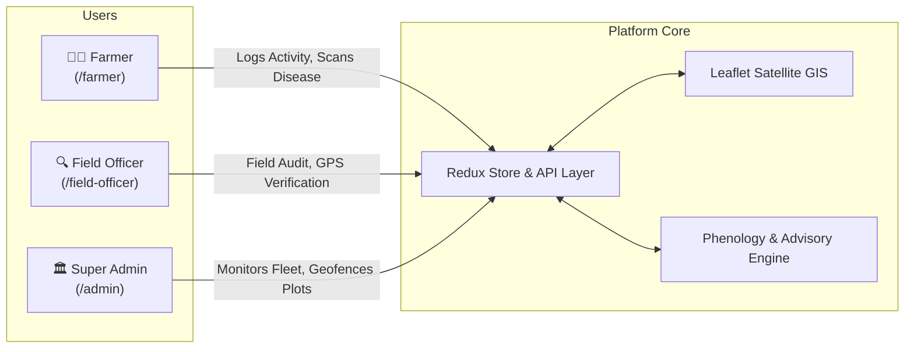
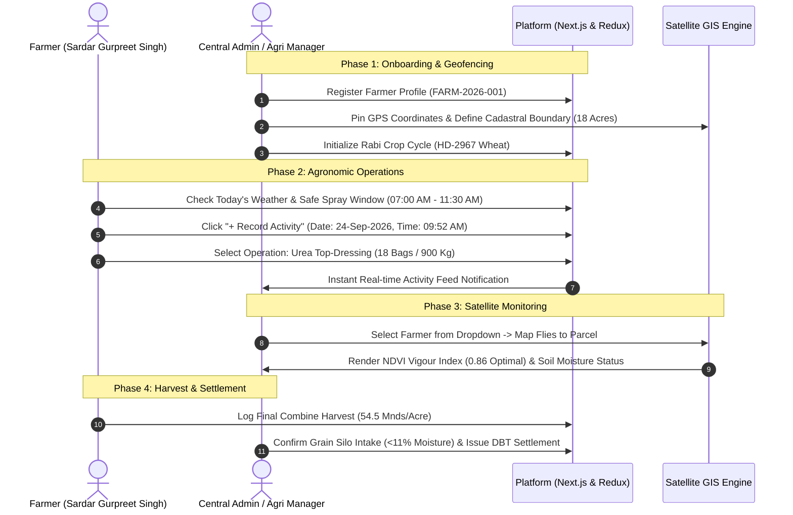

# Krishi AgriTech: Farmer & Wheat Crop Monitoring System
## Project Overview, System Architecture & End-to-End Workflow Document

---

### 📌 Document Metadata
- **Project Name:** Krishi AgriTech (Farmer & Crop Management System)
- **Target Crop (MVP):** Wheat (गेहूं - Rabi Season 2025-26)
- **Tech Stack:** Next.js 16 (App Router), TypeScript, Redux Toolkit, Tailwind CSS, Leaflet Satellite GIS, Radix UI Primitives, Lucide Icons.
- **Audience:** Technical Leads, Project Managers, Agri-Operations Teams, Developers.

---

## 1. Executive Summary & Objective
**Krishi AgriTech** is an enterprise-grade digital agriculture platform designed to bridge the gap between **Farmers (Growers)**, **Field Officers (Agronomists)**, and **Central Administration (Agri-Managers)**. 

The application provides:
1. **Interactive GIS Satellite Geofencing:** Real-time field parcel mapping with interactive GPS coordinates and farmer zoom inspection.
2. **Crop Phenology Tracking:** 11-stage chronological wheat lifecycle tracking (from Land Prep to Harvest) coupled with Sentinel-2 NDVI canopy health scoring.
3. **Daily Agronomic Logging:** Timestamped farmer activity logging (Urea/DAP fertilizer dosage, canal/tube-well irrigation, pesticide spraying) synced instantly to Admin.
4. **Smart Micro-Climate & Mandi Intelligence:** 24-hour spray safety windows, soil moisture telemetry, and live Grain Mandi procurement pricing.

---

## 2. Core User Roles & Portals



### 1. 👨‍🌾 Farmer Portal (`/farmer`)
- **Clean MVP Interface:** Tailored for easy mobile/desktop access by growers.
- **Live Crop Status:** Current phenology stage (`Heading / Flowering`), monitored acreage, and NDVI vigour index.
- **"+ Record Activity" Modal:** 
  - Exact **Execution Date** (`YYYY-MM-DD`) and **Execution Time** (`HH:MM AM/PM`).
  - Dropdown for Field Plot selection.
  - Quick presets for **Urea Top-Dressing** (e.g. `1 Bag/Acre = 18 Bags (900 Kg)`), DAP, Irrigation, and Sprays.
  - Operation cost and field notes.
- **Smart Weather & Crop Advisory:**
  - Micro-climate cards: 27°C, Humidity (55%), Soil Temperature (19.5°C), Soil Moisture (64%).
  - **Spray Window Matrix:** Recommends optimal safe hours (`07:00 AM - 11:30 AM`) based on wind speed and precipitation.
  - **Live Grain Mandi Rates:** Govt MSP (₹2,275) vs Khanna Mandi (₹2,420) vs Silo Gate Rates (₹2,480).
- **AI Crop Doctor:** Visual leaf scanner for Yellow/Stripe Rust detection and direct helpline connection.

### 2. 🏛️ Central Admin Dashboard (`/admin`)
- **Interactive GIS Satellite Map:** 
  - Real-time CAD parcel polygons with NDVI health overlays.
  - **Farmer Selector Dropdown:** Smooth `flyTo` camera animation directly focusing on the chosen farmer's parcel.
  - Live dossier sidebar displaying parcel acreage, farmer CNIC, crop health, and recent activities.
- **Farmer Management (`/admin/farmers`):** Enrolled grower database, CNIC verification, village cadastral mapping.
- **Land Parcels & GPS (`/admin/land-parcels`):** Satellite Location Picker with draggable pin, live GPS detection, and automated acreage calculations.
- **Crop Cycles (`/admin/crop-cycles`):** Variety distribution (`HD-2967`, `PBW-824`), stage progress bars, and target harvest yield estimation.
- **Field Activities Feed (`/admin/activities`):** Centralized chronological feed of all farmer-logged inputs with dosage, cost, and agronomist verification status.
- **Harvest & Production (`/admin/harvest`):** Silo gate intake, moisture analysis (<11%), quality grades, and final settlement logs.

### 3. 🔍 Field Officer Portal (`/field-officer`)
- Mobile-first interface for on-field scouting, ground truth verification, pest threshold evaluation, and farmer assistance.

---

## 3. End-to-End Operational Lifecycle Workflow



---

## 4. Key Data Models & Schemas

| Entity | Primary Attributes | Purpose |
|---|---|---|
| **Farmer** | `id`, `fullName`, `cnicOrGovtId`, `contactPhone`, `village`, `district`, `totalLandAcres` | Core identity and KYC verification |
| **LandParcel** | `id`, `farmerId`, `parcelCode`, `khasraNo`, `totalAcreage`, `centerLat`, `centerLng`, `polygonCoordinates` | Cadastral mapping and satellite GIS integration |
| **CropCycle** | `id`, `farmerId`, `cropVariety`, `season`, `sowingDate`, `currentStage`, `ndviScore`, `expectedYield` | Phenology tracking from Sowing to Harvest |
| **FieldActivity** | `id`, `farmerId`, `parcelId`, `activityType`, `executedDate`, `dosageOrVolume`, `cost`, `status` | Traceability of fertilizers, irrigation, and sprays |
| **WeatherDay** | `date`, `day`, `tempMax`, `tempMin`, `condition`, `windSpeedKmh`, `rainChancePct`, `humidityPct`, `farmingAdvice` | Micro-climate forecasting and spray intelligence |

---

## 5. Technical Highlights & Best Practices

1. **Next.js 16 App Router:** Server-side layout structuring with optimized client-side hydration for dynamic GIS mapping.
2. **Dynamic Leaflet Integration:** SSR-safe dynamic imports with `ssr: false` preventing window execution bugs on Node.js runtime.
3. **Z-Index Layer Architecture:** Configured `z-[1000]+` modals and popovers ensuring seamless overlays above OpenStreetMap and ESRI World Imagery satellite tile canvases (`z-[400]`).
4. **State Predictability:** Centralized Redux Toolkit store with structured slices for instant cross-portal updates without unnecessary re-fetching.
5. **Responsive Design System:** Mobile-first responsive layouts supporting both on-field smartphones and high-resolution command center displays.

---

## 6. How to Run and Verify Locally

```bash
# 1. Install Dependencies
npm install

# 2. Run Next.js Development Server
npm run dev

# 3. Access Live Portals:
# - Admin GIS Command Center: http://localhost:3000/admin
# - Farmer Portal:           http://localhost:3000/farmer
# - Field Officer Portal:    http://localhost:3000/field-officer
```

---
*Prepared by Development Team • Krishi AgriTech Project*
