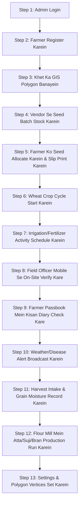

# 🌾 Krishi AgriTech — Complete User Runbook & Step-by-Step Execution Guide
*(पहले कदम से आखिरी कदम तक पूरा प्रैक्टिकल फ्लो)*

---

## 🚀 0. Application Kaise Start Karein (Startup Commands)

### 1. Backend API (FastAPI - Python)
Terminal mein ye command chalayein:
```bash
cd "c:\AB Project\Farmer Management\backend"
py -m uvicorn app.main:app --port 8000 --host 127.0.0.1
```
*Backend URL:* `http://127.0.0.1:8000` | *Swagger API Docs:* `http://127.0.0.1:8000/docs`

### 2. Frontend Web App (Next.js)
Naye terminal mein ye command chalayein:
```bash
cd "c:\AB Project\Farmer Management"
npm start
```
*Frontend URL:* `http://localhost:3000`

---

## 📋 Complete Step-by-Step User Flow (Step 1 se Step 13)



---

### 🔹 STEP 1: Login & Dashboard Access
1. Browser mein `http://localhost:3000/login` kholein.
2. Apne credentials enter karein (ya demo quick login use karein).
3. Login hote hi aap **Admin Control Center** (`/admin`) par land karenge jaha:
   - Total Enrolled Farmers count
   - Satellite Monitored Acreage
   - Live Season Health Index
   - Active Alert Summary dikhegi.

---

### 🔹 STEP 2: Naye Kisaan (Farmer) Ko Enrol Karein
1. Left sidebar se **"Farmer Directory"** (`/admin/farmers`) par click karein.
2. Top right par **"+ Enroll New Farmer"** button dabayein.
3. Form mein details bharein:
   - **Full Name**: (e.g. *Sardar Balwinder Singh*)
   - **Father's Name**: (e.g. *Gurmail Singh*)
   - **Mobile Number**: (e.g. *9876543210*)
   - **Aadhaar / National ID**: (e.g. *35201-8765432-1*)
   - **Village & District**: (e.g. *Samrala, Ludhiana*)
   - **Total Cultivable Land**: (e.g. *15.0 Acres*)
4. **"Submit & Enroll Farmer"** dabayein. 
   *(Note: Agar koi mandatory field chhoota to turant toast message warning aayegi).*
5. Farmer table mein naya farmer live add ho jayega.

---

### 🔹 STEP 3: Kisaan Ke Khet (Land Parcel) Ka GIS Polygon Draw Karein
1. Left sidebar se **"GIS Land Parcels"** (`/admin/land-parcels`) par jayein.
2. **"+ Register Land Parcel"** button click karein.
3. Form steps:
   - **Select Enrolled Farmer**: Dropdown se step 2 mein banaya gaya farmer select karein.
   - **Field Name**: (e.g. *Samrala North Wheat Block #1*)
   - **Khasra / Title Deed No**: (e.g. *KH-412/9B*)
   - **Area (Acres)**: (e.g. *5.0*)
   - **Soil Type**: *Alluvial Loam* / *Clayey* / *Sandy*
4. **Interactive Map par Pin Point Karein**:
   - Marker ko drag karke khet ki exact GPS location par le jayein.
   - Polygon boundary auto-draw ho jayegi (4, 6, ya 8 points as per setting).
5. **"Save Land Parcel"** dabayein.

---

### 🔹 STEP 4: Seed Vendor Se Warehouse Inventory Stock Karein
1. Left sidebar se **"Seed Distribution"** (`/admin/seed-distribution`) par jayein.
2. **"+ Receive Vendor Supply"** button dabayein.
3. Details bharein:
   - **Authorized Vendor**: (e.g. *Punjab State Seeds Corporation*)
   - **Seed Variety**: (e.g. *HD-2967* / *PBW-550* / *DBW-187*)
   - **Batch / Lot Number**: (e.g. *BATCH-PB-2026-W09*)
   - **Received Quantity (KG)**: (e.g. *1000*)
   - **Delivery Date & Invoice No**: (e.g. *INV-8891*)
4. **"Add to Warehouse Inventory"** click karein. Stock warehouse mein instantly jud jayega.

---

### 🔹 STEP 5: Farmer Ko Certified Beej Allocate Karein & Official Slip Print Karein
1. `Seed Distribution` page par **"+ Allocate Seed to Farmer"** dabayein.
2. 3 simple steps select karein:
   - **Step 1: Select Seed Batch**: Jisme available stock dikhega.
   - **Step 2: Select Farmer Recipient**: Farmer ka naam & village.
   - **Step 3: Select Target Field Plot**: Kisaan ka register khet.
   - **Quantity (KG)**: (e.g. *100 KG*)
3. **"Confirm Seed Allocation"** dabayein.
4. Table mein allocation aayegi, waha **"View Slip"** par click karein:
   - Ek **Official Digital Passbook Slip** open hogi jisme `Slip No: SLIP-#...`, Farmer Name, Variety, aur Verification seal hogi.

---

### 🔹 STEP 6: Seasonal Wheat Crop Cycle Start Karein
1. Left sidebar se **"Crop Cycles"** (`/admin/crop-cycles`) par jayein.
2. **"+ Initiate Crop Cycle"** dabayein.
3. Details select karein:
   - **Farmer**: Kisaan ka naam
   - **Land Parcel**: Khet ka code
   - **Seed Variety**: HD-2967
   - **Sowing Method**: *Precision Drill Sowing* / *Raised Bed Planting* / *Zero Tillage*
   - **Cultivated Acreage**: (e.g. *5.0 Acres*)
   - **Sowing Date**: Date chunein.
4. **"Initiate Monitoring"** dabayein.
5. Cycle shuru ho jayegi aur **11 Phenology Stages** (Tillering, Jointing, Booting, Flowering, Milk, Dough, Maturity) track hone lagengi.

---

### 🔹 STEP 7: Agronomic Operations (Khaad, Paani, Dawa) Schedule Karein
1. Left sidebar se **"Agronomic Activities"** (`/admin/activities`) par jayein.
2. **"+ Schedule Field Operation"** dabayein.
3. Details select karein:
   - **Select Farmer & Field**
   - **Operation Type**:
     - *Canal/Tubewell Irrigation* (पहला पानी / Rauni)
     - *Urea Split Top-Dressing* (यूरिया खाद)
     - *DAP Basal Fertilizer* (डीएपी)
     - *Fungicide Rust Spray* (पीला रतुआ स्प्रे)
   - **Target Date & Dosage**: (e.g. *1 Bag Urea per Acre*)
4. **"Schedule Operation"** dabayein. Status `SCHEDULED` ban jayega.

---

### 🔹 STEP 8: Field Officer Mobile Se Khet Par Ja Kar Verify Kare
1. URL `http://localhost:3000/field-officer` kholein (Mobile responsive view).
2. Field Officer khet par jaakar:
   - **Tab 1: Assigned Field Parcels**: Khet ka GPS location verify karega.
   - **Tab 2: On-Site Activity Logger**: Farmer ke saamne Paani ya Khaad dalne ko **Mark as Completed** karega.
   - **Tab 3: Crop Stage Advance**: Khet dekhkar stage *Tillering* se *Jointing* advance karega.

---

### 🔹 STEP 9: Farmer Apne Mobile Passbook Portal Par Kaise Dekhega
1. URL `http://localhost:3000/farmer` kholein.
2. Kisaan ko uska apna digital passbook dikhega:
   - **Digital Seed Receipts**: Kitne bag beej mile.
   - **Kisan Diary (Self-Logger)**: Kisaan khud phone se log kar sakta hai ki aaj usne paani diya ya spray kiya.
   - **Mandi Wheat MSP Price Widget**: Live sarkari rate (₹2,275 / Quintal).
   - **Daily Weather Forecast**: Taapmaan, Barish aur Hawa ki raftaar.

---

### 🔹 STEP 10: Mausam & Bimaari (Yellow Rust) Ka Emergency Alert Bhejein
1. Left sidebar se **"Advisory & Alerts"** (`/admin/alerts`) par jayein.
2. **"+ Broadcast Alert"** click karein:
   - **Alert Type**: *Yellow Rust Warning* ya *Hailstorm Forecast*
   - **Severity**: *CRITICAL* / *WARNING* / *INFO*
   - **Description & Solution**: (e.g. *Propiconazole @ 200ml per acre spray karein*).
3. **"Broadcast Alert Now"** dabayein. Ye alert sabhi kisaano aur field officers ke dashboard par instantly pop-up hoga.

---

### 🔹 STEP 11: Fasal Kataai (Harvest Intake) & Silo Storage
1. Left sidebar se **"Harvest & Storage"** (`/admin/harvest`) par jayein.
2. **"+ Record Harvest Intake"** dabayein.
3. Intake parameters bharein:
   - **Farmer & Field**
   - **Harvested Yield (Maunds / Kg)**: (e.g. *250 Maunds = 10,000 KG*)
   - **Lab Moisture %**: (e.g. *11.2%* - Standard dry grain)
   - **Quality Grade**: *Grade A Premium (>92% Gluten)*
   - **Assigned Silo**: (e.g. *Strategic Silo #4*)
4. **"Record Harvest Intake"** click karein. Stock Silo mein transfer ho jayega.

---

### 🔹 STEP 12: Flour Milling & Final Production Output
1. Left sidebar se **"Flour Milling"** (`/admin/production`) par jayein.
2. **"+ Start Milling Batch"** click karein:
   - Silo se Raw Wheat select karein (e.g. *10,000 KG*).
3. System automatic production breakdown calculate karega:
   - **Chakki Fine Atta (60%)**: `6,000 KG`
   - **Maida (10%)**: `1,000 KG`
   - **Semolina / Suji (7%)**: `700 KG`
   - **Bran / Choker (23%)**: `2,300 KG` (Animal feed)
4. **"Process Milling Run"** dabayein. Complete supply chain cycle complete ho gayi!

---

### 🔹 STEP 13: Admin Settings & Polygon Configuration
1. Left sidebar se **"Settings & Config"** (`/admin/settings`) par jayein.
2. Yaha se aap:
   - **Polygon Accuracy Points**: 4-Corner, 6-Corner, ya 8-Corner select kar sakte hain.
   - **Map Boundary Colors**: Emerald Green, Amber, Cyan, Purple set kar sakte hain.
   - **MSP & Subsidy Rates**: Sarkari MSP rate update kar sakte hain.
   - **System Audit Trail Logs**: Kis officer ne kya change kiya uska immutable log dekh sakte hain.

---

## ✅ Summary Checklist

| # | Step | Page / URL | Output |
|---|---|---|---|
| 1 | Admin Login | `/login` | Access Granted |
| 2 | Enrol Farmer | `/admin/farmers` | Grower Passbook Generated |
| 3 | Map Land Parcel | `/admin/land-parcels` | GIS Polygon Saved on GPS Map |
| 4 | Stock Seed Batches | `/admin/seed-distribution` | Warehouse Inventory Added |
| 5 | Distribute Seed | `/admin/seed-distribution` | Official Digital Slip Printed |
| 6 | Start Crop Cycle | `/admin/crop-cycles` | 11-Stage Phenology Monitoring Active |
| 7 | Schedule Activity | `/admin/activities` | Agronomic Prescription Issued |
| 8 | Field Officer Check | `/field-officer` | On-Site Verification Completed |
| 9 | Farmer Mobile View | `/farmer` | Kisan Diary & Receipt Accessed |
| 10 | Send Alert | `/admin/alerts` | Advisory Broadcast to Mobile |
| 11 | Harvest Intake | `/admin/harvest` | Grain Stored in Silo with Moisture % |
| 12 | Flour Milling | `/admin/production` | Atta, Maida, Suji, Choker Produced |
| 13 | Configure System | `/admin/settings` | GIS & Financial Parameters Synced |

---
*Krishi AgriTech Digital Platform Documentation*
